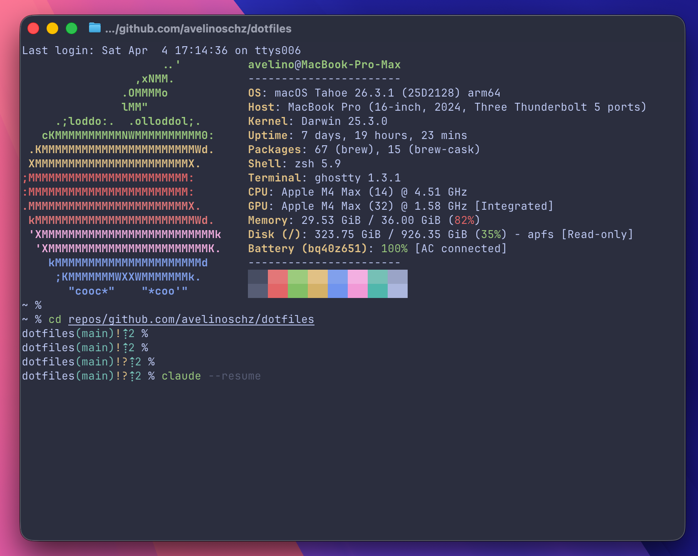

# dotfiles


Opinionated macOS developer environment managed via Homebrew and asdf — shell, editors, terminal, and tooling configs for a consistent setup across machines.



## Quick Start

```bash
# 1. Clone the repo
git clone https://github.com/avelinoschz/dotfiles.git ~/dotfiles && cd ~/dotfiles

# 2. Bootstrap the machine (see what it installs below)
./scripts/setup.sh
```

`scripts/setup.sh` handles everything end-to-end: Xcode CLI tools, Homebrew, all packages and apps, asdf runtimes, Claude Code, VS Code extensions, SSH/GPG config deployment, and dotfiles. No manual steps required after step 2.

Preview what will run before committing:

```bash
./scripts/setup.sh --dry-run
```

## What setup.sh installs

| Category | Tools |
| -------- | ----- |
| **CLI tools** | bat, fastfetch, git, gnupg, mole, neovim, pinentry-mac, tmux, tree, zsh-autosuggestions, zsh-syntax-highlighting |
| **Version manager** | asdf → python, nodejs, golang (versions from `.tool-versions`) |
| **Terminal & editors** | Ghostty, VS Code, Sublime Text, Cursor |
| **IDEs** | GoLand, PyCharm, CLion |
| **Dev tools** | TablePlus, Bruno, Docker Desktop, GitHub CLI, GitHub Desktop |
| **AI** | Claude, ChatGPT, Codex, Copilot CLI, Gemini CLI, OpenCode |
| **Claude Code** | Native installer (always latest version) |
| **VS Code extensions** | From `vscode-extensions.txt` |

## Make

All scripts are accessible via `make`. Run `make` or `make help` to see available targets.

`push`, `pull`, `push-dry` and `pull-dry` accept an optional filename to scope the operation to a single file:

```bash
make push .zshrc          # → ./scripts/push.sh .zshrc
make push-dry .zshrc      # → ./scripts/push.sh --dry-run .zshrc
make pull .gitconfig      # → ./scripts/pull.sh .gitconfig
```

`push-restore` and `push-clean` only operate on all files. For file-specific restore or clean, use the scripts directly — they expose the full set of flags:

```bash
./scripts/push.sh --restore .zprofile
./scripts/push.sh --clean .zshrc
```

```text
Usage: make <target>

Bootstrap
  setup            Run full machine bootstrap
  setup-dry        Preview bootstrap without making any changes
  keys             Deploy SSH and GPG configs to $HOME
  keys-dry         Preview SSH/GPG deployment without deploying
  secrets          Initialize $HOME/.zsh_secrets from .env.example
  secrets-dry      Preview secrets initialization without writing files

Dotfiles — push (repo → $HOME)
  push             Apply all dotfiles, or a specific file: make push .zshrc
  push-dry         Preview changes without applying: make push-dry .zshrc
  push-restore     Restore most recent backup for all files
  push-clean       Delete all backups

Dotfiles — pull ($HOME → repo)
  pull             Capture all dotfiles, or a specific file: make pull .gitconfig
  pull-dry         Preview capture without pulling: make pull-dry .gitconfig
```

## Scripts

| Script | Description |
| ------ | ----------- |
| `scripts/setup.sh` | Full machine bootstrap. Supports `--dry-run` to preview without installing. |
| `scripts/setup-keys.sh` | Deploy SSH and GPG config files from the repo to `$HOME`. Supports `--dry-run`. |
| `scripts/init-secrets.sh` | Initialize `~/.zsh_secrets` from `.env.example` without overwriting existing values. Supports `--dry-run`. |
| `scripts/push.sh` | Apply dotfiles from repo to `$HOME`. Shows diff and asks confirmation per file. Supports `--dry-run`. |
| `scripts/pull.sh` | Capture dotfiles from `$HOME` into the repo. Shows diff and asks confirmation per file. Supports `--dry-run`. |

### Dry run

All scripts support `--dry-run` (or `-n`) — prints every command that would run without executing anything:

```bash
./scripts/setup.sh --dry-run
./scripts/setup-keys.sh --dry-run
./scripts/init-secrets.sh --dry-run
./scripts/push.sh --dry-run --all
./scripts/pull.sh --dry-run --all
```

### Secrets

Use `.env.example` as documentation for variables required by your dotfiles.

```bash
# Create ~/.zsh_secrets if missing and append any missing variables
./scripts/init-secrets.sh

# Then edit your local secrets file and set real values
nvim ~/.zsh_secrets

# Reload shell config
source ~/.zshrc
```

`~/.zsh_secrets` is local-only and must never be committed.

### push.sh

```bash
# Apply all tracked dotfiles to $HOME
./scripts/push.sh --all

# Apply a single file
./scripts/push.sh .zshrc

# Restore the most recent backup
./scripts/push.sh --restore --all
./scripts/push.sh --restore .zshrc

# List and delete all backups
./scripts/push.sh --clean --all
./scripts/push.sh --clean .zshrc
```

Backups are saved as `~/<file>.bak.YYYYMMDD_HHMMSS` on every apply.
`--dry-run` is not compatible with `--restore` or `--clean`.

### pull.sh

```bash
# Capture all tracked dotfiles from $HOME into the repo
./scripts/pull.sh --all

# Capture a single file
./scripts/pull.sh .zprofile
```

## Tracked files

### push.sh (repo → $HOME)

| File | Description |
| ---- | ----------- |
| `.zshrc` | Zsh configuration, git prompt styling |
| `.zsh_git_prompt` | Git prompt status function |
| `.zprofile` | Login shell config: Homebrew PATH setup |
| `.tool-versions` | asdf runtime versions (Python, Node.js, Go) |
| `.config/ghostty/config` | Ghostty terminal configuration |
| `.config/fastfetch/config.jsonc` | Fastfetch system info configuration |

### pull.sh ($HOME → repo)

| File | Description |
| ---- | ----------- |
| `.gitconfig` | Git user config, signing key, LFS filters |
| `.zprofile` | Login shell config |
| `.config/opencode/opencode.json` | OpenCode global configuration |
| `.config/opencode/AGENTS.md` | OpenCode global agent rules |
| `.agents/skills/context7-mcp/SKILL.md` | Context7 MCP skill configuration |
| `.claude/settings.json` | Claude Code settings |
| `.claude/statusline-command.sh` | Claude Code statusline script |

### setup-keys.sh (repo → $HOME, non-destructive)

| File | Description |
| ---- | ----------- |
| `.ssh/config` | SSH client configuration (chmod 600) |
| `.gnupg/gpg-agent.conf` | GPG agent configuration (chmod 600) |

Only deploys if the destination doesn't exist — never overwrites an existing config.

## Git Prompt

The zsh prompt displays git status using a custom `_git_prompt_status` function (`.zsh_git_prompt`), following Starship symbol and color conventions. No special fonts required.

| Symbol | Color | Meaning |
| ------ | ----- | ------- |
| `(main)` | cyan | Current branch |
| `⇡N` | cyan | Ahead of remote by N commits |
| `⇣N` | red | Behind remote by N commits |
| `⇡N⇣N` | red | Diverged from remote |
| `+` | green | Staged files |
| `!` | yellow | Modified files |
| `»` | yellow | Renamed files |
| `✘` | red | Deleted files |
| `?` | yellow | Untracked files |
| `$` | blue | Stash exists |
| `=` | red | Unmerged conflicts |

Example: `dotfiles(main)!?⇡2 %`

## License

MIT © [avelinoschz](https://github.com/avelinoschz)
